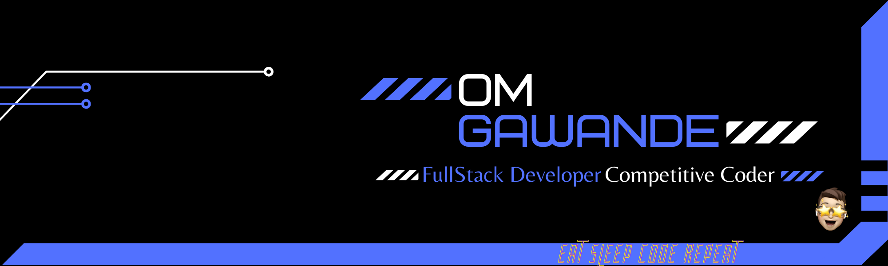

[](https://github.com/spyware007)

# .gif>)[OM GAWANDE](https://github.com/Spyware007) 


</a>

</a>

<p align="center">
  <a href="https://github.com/Spyware007/readme-typing-svg"></a>
</p>


	
</br>
	
  <summary><h2><b>🥇 Open Source Projects open for contributions.</b></h2></summary>


  <br />
  <table>
    <thead align="center">
      <tr border: none;>
        <td><b>💻 Projects</b></td>
        <td><b>🌟 Stars</b></td>
        <td><b>🍴 Forks</b></td>
        <td><b>🐛 Issues</b></td>
        <td><b>🔔 Pull Requests</b></td>
        <td><b>👨‍💻 Language</b></td>
      </tr>
    </thead>
    <tbody>
      <tr>
	      <td><a href="https://github.com/spyware007/Animating-Buttons"><b>🚀 Animating Buttons</b></a></td>
        <td></td>
        <td></td>
        <td></td>
        <td></td>
        <td></td>
      </tr>
    </tbody>
  </table>

<br/>  

🌟 STAR THE REPOS IF YOU LIKE 🌟

	


# About Me 

I am Om Gawande, currently in 3rd year pursuing my Computer Engineering journey from D.Y. Patil College Of Engineering, Akurdi, Pune. <br />
I love **competitive programming**. I am a **3-star⭐️** coder at Codechef.
<br />
Full Stack Developer!<br />
Not like the rest of them<br />
Who doesn’t love a totally strange message from a stranger about something completely random? Just drop a **Hi** 👋 [here](https://www.linkedin.com/in/om-gawande/) ! <br />

</a>

# Let's Connect 

<div align="center">
 <a href="https://www.linkedin.com/in/om-gawande/" target="_blank">

</a>
  
 <a href="https://github.com/Spyware007" target="_blank">

</a>
  
 <a href="https://twitter.com/_s_p_i_d_e_y_1" target="_blank">

</a>

<a href="https://spyware.hashnode.dev/" target="_blank">

</a>

<a href="mailto:omgawandeofficial9834899149@gmail.com" target="_blank">

</a>

<a href="https://www.instagram.com/_s_p_i_d_e_r_9480/" target="_blank">

</a>

<a href="https://www.facebook.com/om.gawande.79274" target="_blank">

</a>

</div>

---

# Web Tech Stack 

<div align="left">

 
 
 


<!--  -->


<!--  -->
<!--  -->
<!--  -->


</div>

---

# Languages 

<div align="left">
   
   
  
  
  
</div>

---

# Databases 

<div align="left">
  <!--  -->
  
  
  <!--  -->
  <!--  -->
</div>

---

# Hosting 

<div align="left">
  <!--  -->
  <!--  -->
  
  
  
  
</div><br/>

---

# UI/UX 

<div align="left">
  
</div>

</a>

### My recent GitHub activity ⚡️

<!--START_SECTION:activity-->
1. 🗣 Commented on [#145](https://github.com/GrabBits/GrabBits_Website/issues/145) in [GrabBits/GrabBits_Website](https://github.com/GrabBits/GrabBits_Website)
2. 🔒 Closed issue [#1567](https://github.com/Spyware007/Animating-Buttons/issues/1567) in [Spyware007/Animating-Buttons](https://github.com/Spyware007/Animating-Buttons)
3. 🎉 Merged PR [#1601](https://github.com/Spyware007/Animating-Buttons/pull/1601) in [Spyware007/Animating-Buttons](https://github.com/Spyware007/Animating-Buttons)
4. 🗣 Commented on [#1561](https://github.com/Spyware007/Animating-Buttons/issues/1561) in [Spyware007/Animating-Buttons](https://github.com/Spyware007/Animating-Buttons)
5. 🔒 Closed issue [#1590](https://github.com/Spyware007/Animating-Buttons/issues/1590) in [Spyware007/Animating-Buttons](https://github.com/Spyware007/Animating-Buttons)
<!--END_SECTION:activity-->

</a>

## My Latest Blog Posts 👇

<!-- HASHNODE_BLOG:START -->
<p align="left">
<a href="https://spyware.hashnode.dev//gdscwebspecialist" title="How did I become a GDSC WEB Specialist(Lead)? 🚀"></a>
<a href="https://spyware.hashnode.dev//gdscwebspecialist" title="How did I become a GDSC WEB Specialist(Lead)? 🚀"><strong>How did I become a GDSC WEB Specialist(Lead)? 🚀</strong></a>
<div><strong>30 Aug 2022</strong></div>
<br/> Let's start. 🚀
It all started with the name SPIDER. 🕸
I like when people call me by that name.

Backstory. 🔙
At first, I didn't have any idea what I was doing after I bought a MacBook Air ( except showoff ). Later I figured out about Competitive P... </p> <br/> <br/>
<p align="left">
<a href="https://spyware.hashnode.dev//flipverse" title="Flipverse - The Journey of Flipkart Grid Challenge  🚀"></a>
<a href="https://spyware.hashnode.dev//flipverse" title="Flipverse - The Journey of Flipkart Grid Challenge  🚀"><strong>Flipverse - The Journey of Flipkart Grid Challenge  🚀</strong></a>
<div><strong>28 Aug 2022</strong></div>
<br/> It was just a normal day when I got a message from Dhruv Kothari on Super 30 (our small community) of Web Dev saying "Guys team banao and aag lagao 🔥" with a registration link for Flipkart Grid 4.0 Hackathon.
I didn't have any such motivation to par... </p> <br/> <br/>
<!-- HASHNODE_BLOG:END -->

</a>

<table>
  <tr>
    <td></td>
    <td></td>
  </tr>
</table>

---

<div align="center">
<p></p>
  </div>
  
</a>


---

```javascript
if (isAwesome) {
  // thanks in advance :p
  starThisRepository();
}
```

---

Leave a ⭐ from [here](https://github.com/Spyware007/Spyware007) if you like 😁

I tweet sometimes

[](https://twitter.com/oom_gawande)
